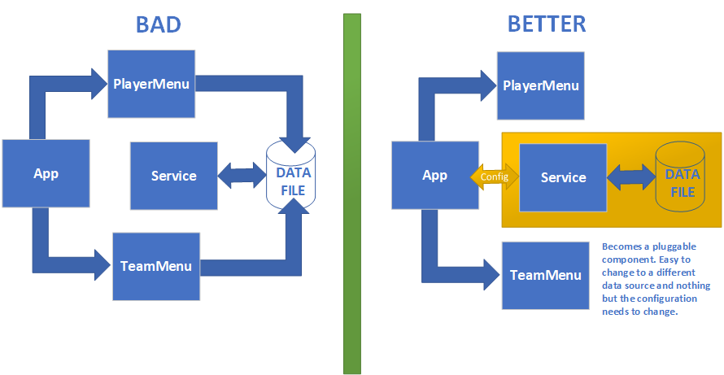

# TeamRoster w/ Json Data - Solution
The solution to our TeamRoster w/ Json Data code challenge will probably not be what you expect.
Adding validation to the age and preventing it from being zero is as simple as a `while()` loop 
and an if statement. Finishing the team menu can be as simple as copying and pasting some
of the existing code and swapping the `player` class for the `team` class. 
> You can see that solution in the [SimpleSolution](https://github.com/ericallenpaul/TeamRoster-Json/tree/SimpleSolution) 
branch of the challenge

Instead of focusing on those specific problems we'll take a larger view of the project
and solve those problems by *refactoring* some of the fundamental architecture of the code.
Refactoring is the process of changing the structure of your code without changing the 
functionality of the program.

When I refactor I'm looking at things primarily with an eye for future code changes.
So most of the items I'll be changing are so that any changes to my program in the 
future will be easier. Questions that I ask myself when I refactor:

- Do I have any duplicated code?
- Are my method names and variable names consistent?
- Is there any code that is difficult to understand that can be simplified?
- Do I have any long methods that could be spilt into multiple methods?
- How hard would it be to add another class and extend the programs functionality?
- Are there patterns in my code that allow me to use generics to simplify my code?
- Do I have any classes that could benefit from inhertience, encapsulation or polymorphism?

We'll begin by pointing out the problems 

> We'll be completely skipping Unit testing and the
items related to Unit testing just to keep things simple.

### Problem 1 - Repetitive and inflexible message system
There are several places in our code where we use code like:

```
Console.Write($"ERROR: Could not find player with ID: {playerId}.");
System.Threading.Thread.Sleep(1000);
```
Functionally there is no problem with this code, but from expirience I can tell you that 
this code is very likely to change. We may want to log these messages or change the amount 
of time the message appears on screen. If that becomes a requested change
there are too many places I have to look in the code to implement that change.
Good code should be easy to change so we'll add a class to handle all of our messaging.
Right-click the TeamRoster.App project and add a class called `ConsoleMessage`.

```
using System;
using System.Collections.Generic;
using System.Text;

namespace TeamRoster.App
{
    public class ConsoleMessage
    {
        private static int _defaultMessageTimeout = 1000;

        /// <summary>
        /// Shows the message on the console.
        /// </summary>
        /// <param name="message">The message to be displayed.</param>
        /// <param name="messageTimeout">The message timeout controls how long the message stays on screen.
        /// This parameter is optional, omit it to use the default setting</param>
        /// <remarks>The default message timeout is 1 second</remarks>
        public static void ShowMessage(string message, int? messageTimeout = null)
        {
            Console.WriteLine();
            Console.WriteLine(message);
            System.Threading.Thread.Sleep(messageTimeout ?? _defaultMessageTimeout);
        }

    }
}
```

Now we'll go back and change all of our messages so that they use this one common method.
This will make future changes nuch easier. Now if you get a new requirement like
"All error messages should be red and logged" it will be much easier to change.

> Normally, I wouldn't be handling any message operations and I'd depend on a library 
> like [Nlog](https://nlog-project.org/)
> which is a standard way to handle messages in an application. It's always important to
> consider **Best Practices** and look for standards when writing your application. 

### Problem 2 - Bad SOC (Seperations of concerns)
The whole point of having seperate projects is keeping functionally simaliar operations 
together in the same project. For example, my service project doesn't use `Console.Write()` 
because that's a UI function (Well as much UI you can have in a console app anyway). 
The UI should be completly isolated from the data. Since we're using flat files as our data,
it seems logical that the console should control where the data is stored, but beyond configuration
the PlayerMenu should be free from knowing anything at all about the data files. 
I noticed that in the `Add()` method of the menu I add a player like this:

```
//call the player service and add the player
player = _playerService.Add(player, _playerList);
```

In this instance the _playerList is really not needed. Once the application 
passes the configuration to the service project the individual methods become *less aware*
of what's going on with the data. By having the PlayerMenu assign the data directory I
created a direct tie-in to the data files. In my opinion this is bad seperation between the UI
and the data. I should be able to switch the service project over to SQL without ever 
touching anything but the application configuration.

 
>Visualization of the connections 
 
So we'll fix this problem by placing the responsibility for the location of the data
directory on the app and not the menu. In `Program.cs` is where I'll place the directory 
information. I'll declare the following as a public variable:

```
public static string DataDir;
public static string ProgramDirectory { get; set; } = AppDomain.CurrentDomain.BaseDirectory;
```

Then in my `Main()` method I can assign a value likie this:

```
static void Main(string[] args)
{
    DataDir = $@"{Program.ProgramDirectory}Data\";
    MainMenu.Run();
}
```

Now I can instantiate the service by calling to the new variable.

```
_playerService = new PlayerService(Program.DataDir);
```

Then I just need to change my PlayerService so it no longer requires the data path anywhere
except the constructor. So the add method for player becomes this:

```
public Player Add(Player player)
{
    List<Player> players = GetAll();

    //get the next player id
    int newPlayerId = GetNextId(players);

    //assign the playe an id
    player.Player_Id = newPlayerId;

    //add the player to the list
    players.Add(player);

    //save the list
    Save(players);

    //return the player with the new ID
    return player;
}
```
Finally I can change the call in my menu to match the new parameters for `Add()`.
```
//call the player service and add the player
player = _playerService.Add(player);
```
This makes alot more sense now and the player menu doesn't know anything 
about the file beyond the configurastion being passed in from the application.

> In a more realistic example, there would probably be an application
> configuration file which would feed this information into the program.
> This also means that no code change would be required if the data directory
> needed to change.


### Problem 3 - "Happy path coding" and Brittle or Fragile code
"Happy path coding" refers to the outcome you want your code to acheive when everything goes right.
It is important to focus on the code's positve result but you also need to account for what happens
when things go wrong. All input should always be validated and checked. In the immortal words of
Fox Mulder: **Trust no one**. If we look at our `Player.Add()` method you can see that there isn't 
really any validation or a way to make certain properties required. The other thing that
becomes obvious from looking at the code is that there is a pattern to collecting the information.

```
//instantiate the new player object 
Player player = new Player();

Console.Write("First Name: ");
player.FirstName = Console.ReadLine();

Console.Write("Last Name: ");
player.LastName = Console.ReadLine();

Console.Write("Team: ");
player.Team = Console.ReadLine();
```

If we were to write this as a requirement we might say something like:

- Create an object 
- Prompt the user of input of specific data type, validate the data
- Ignore some properties (DateAdded is an example)
- Make some properties required

Our code already does these things to an extent but it would be better to find a way to
do this using generics so it can be applied to all of the current and future classes.
So instead of typing all of the code above manually we'll create a method that will except
an empty object as input and handle all of the input and validation.
First we'll need a way to tell our program which fields are required, ignored and what prompt
to use for the enduser. I will use custom data annotations to tell my program how to handle these.
Data annotations can be added directly to the class file. (*To learn more about data 
annotations see [Basic Intoduction to Data Annotations...](https://code.msdn.microsoft.com/Basic-Introduction-to-Data-244734a4)*)
My custom data annotations will work like this:

```
[ConsolePrompt(<user prompt>, <required>, <ignored>, <minimum int>)]
```
Once we decorate our player class with these annotations it looks something like this:

```
public class Player
{

    [ConsolePrompt("Id",true,true)]
    public int Player_Id { get; set; }

    [ConsolePrompt("First Name",true)]
    public string FirstName { get; set; }

    [ConsolePrompt("Last Name", true)]
    public string LastName { get; set; }

    [ConsolePrompt("Team", true)]
    public string Team { get; set; }

    [ConsolePrompt("Age", true, false, 1)]
    public int Age { get; set; }

    [ConsolePrompt("Date Added", true, true)]
    public DateTime DateAdded { get; set; }

}
```

Now we can read from those annotations and use them to instruct our code how
to act. I do this with an [extension method](https://docs.microsoft.com/en-us/dotnet/csharp/programming-guide/classes-and-structs/extension-methods). 
The extension method looks something like this:

```
public static T GetAttributeFrom<T>(this object instance, string propertyName) where T : Attribute
{
    var attrType = typeof(T);
    var property = instance.GetType().GetProperty(propertyName);
    return (T)property.GetCustomAttributes(attrType, false).FirstOrDefault();
}
```

You'll notice this extension method uses `<T>`. This is how generics look in c#. It
is a very common pattern, and `T` stands for any type. I could have hard coded `Player` here
but that would mean adding this method to every class. Using generics this method will now
work for any class. We can call this method like this:

```
var name = player.GetAttributeFrom<ConsoleAttribute>("FirstName").prompt;
//returns "First Name"
```
So now the model itself knows what the prompt needs to be for each property.
The next thing to do is to create a class that will use this information and the
information form the object itself to prompt an end user for every property and
validate the input.
I created a class named `ConsoleInput` and created methods that will make it easy to 
handle the input for any class. Once again I use generics to help me write code that will
work for all classes. It gets an object, figures out the properties and then loops 
through each property. At it loops through it uses our custom data annotations to figure out 
what the prompt should be, whether ot not it should skip the property and whether or not the 
property is required.

> *Note: The actual implementation of this class is less important than the fact that it
> will make all future code much easier to write. Writing generic code is definitely a
> more advanced coding skill and the code can be very difficult to interpret unless
> you're familiar with generics.*

With our new class in place my `Add()` mehtod can go from 38 lines of code to 18.
Not only is this easier to read it's also easier to make new `Add()` methods.
The new imporoved method looks like this:

```
private static void Add()
{
    //get the existing list of players
    _playerList = _playerService.GetAll();

    //instantiate the new player object
    Player player = new Player();

    //for each property get info from the user
    player = ConsoleInput.GetUserInput<Player>();
    
    //get the current date and time for DateAdded
    player.DateAdded = DateTime.Now;

    //call the player service and add the player
    player = _playerService.Add(player);

    //give the user feed back--pause for one second on screen
    string message = $"Success: Added a new player ID: {player.Player_Id}";
    ConsoleMessage.ShowMessage(message);
}
```

The line:
```
player = ConsoleInput.GetUserInput<Player>();
```
is really the one doing all of the work.

The same technique can be used to create a generic version of `GetAll()` and
`Delete()`. We'll set that aside for the moment and move on to the next problem.

> For a real challenge see if you can create the generic version of `GetAll()` and `Delete()`.
> What about `DisplayeMenu()` and `Run()`? Can they also be done in a generic way?

### Problem 4 - Duplicate code across classes


