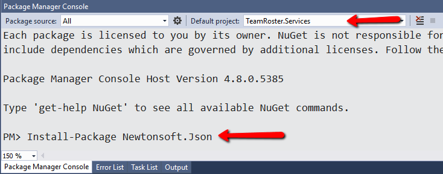

# TeamRoster w/ Json Data - Solution
The solution to our TeamRoster w/ Json Data code challenge will probably not be what you expect.
Adding validation to the age and preventing it from being zero is as simple as a `while()` loop 
and an if statement. Finishing the team menu can be as simple as copying and pasting some
of the existing code and swapping the `player` class for the `team` class.
Instead of focusing on those specific solutions we'll take a larger view of the project
and solve those problems by refactoring some of the fundamental architecture of the code.
We'll begin by pointing out the problems 

> We'll be completely skipping Unit testing and the
items related to Unit testing just to keep things simple.

### Problem 1 - Repetitive and inflexible messages
There are several places in our code where we use code like:

```
Console.Write($"ERROR: Could not find player with ID: {playerId}.");
System.Threading.Thread.Sleep(1000);
```
Functionally there is no problem with this code, but from expirience I can tell you that 
this code is very likely to change. We may want to log these messages or change the amount 
of time the message appears on screen. If that becomes a requested change
there are too many places I have to look in the code to implement that change.
Good code should be easy to change so we'll add a class to handle all of our messaging.
Right-click the TeamRoster.App project and add a class called `ConsoleMessage`.

```
using System;
using System.Collections.Generic;
using System.Text;

namespace TeamRoster.App
{
    public class ConsoleMessage
    {
        private static int _defaultMessageTimeout = 1000;

        /// <summary>
        /// Shows the message on the console.
        /// </summary>
        /// <param name="message">The message to be displayed.</param>
        /// <param name="messageTimeout">The message timeout controls how long the message stays on screen.
        /// This parameter is optional, omit it to use the default setting</param>
        /// <remarks>The default message timeout is 1 second</remarks>
        public static void ShowMessage(string message, int? messageTimeout = null)
        {
            Console.WriteLine();
            Console.WriteLine(message);
            System.Threading.Thread.Sleep(messageTimeout ?? _defaultMessageTimeout);
        }

    }
}
```

Now we'll go back and change all of our messages so that they use this one common method.
This will make future changes nuch easier. Now if you get a new requirement like
"All error messages should be red and logged" it will be much easier to change.

### Problem 1 - "Happy path coding" and Brittle or Fragile code
"Happy path coding" refers to the outcome you want your code to acheive when everything goes right.
It is important to focus on the code's positve result but you also need to account for what happens
when things go wrong. All input should always be validated and checked. In the immortal words of
Fox Mulder: **Trust no one**. If we look at our `Player.Add()` method you can see that there isn't 
really any validation or a way to make certain properties required. The other thing that
becomes obvious from looking at the code is that there is a pattern to collecting the information.

//instantiate the new player object
Player player = new Player();

Console.Write("First Name: ");
player.FirstName = Console.ReadLine();

Console.Write("Last Name: ");
player.LastName = Console.ReadLine();

Console.Write("Team: ");
player.Team = Console.ReadLine();

If we were to write this as a requirement we might say something like:

- Creates an object 
- Prompt the user of input of specific data type, validate the data
- Ignore some properties (DateAdded is an example)
- Make some properties required

Our code already does these things to an extent but it would be better to find a way to
do this using Generics so it can be applied to all of the current and future classes.
So instead of typing all of the code above manually we'll create a method that will except
an empty object as input and handle all of the input and validation.
I'll create a class named `ConsoleInput` and create methods that will make it easy to 
handle the input for any class.


Using attrributes is a way to figure out

```
public static T GetAttributeFrom<T>(this object instance, string propertyName) where T : Attribute
{
    var attrType = typeof(T);
    var property = instance.GetType().GetProperty(propertyName);
    return (T)property .GetCustomAttributes(attrType, false).First();
}

var name = player.GetAttributeFrom<DisplayAttribute>("PlayerDescription").Name;
```


### Problem 3 - Bad SOC (Seperations of concerns)
The whole point of having seperate projects is keeping functionally simaliar operations 
together in the same project. For example, my services don't use `Console.Write()` 
because that's a UI function (Well as much UI you can have in a console app anyway). 
The UI should be completly isolated from the data. Since we're using flat files as our data,
it seems logical that the console should control where the data is stored, but the PlayerMenu
should be free from knowing anything at all about the data files. I noteced that in the `Add()`
method of the menu I add a player like this:

```
//call the player service and add the player
player = _playerService.Add(player, _playerList);
```

There really is no reason for

Some of my menu code actually belongs


I have created 3 projects in the solution.
This will aid in the proper sepearation of 
concerns:

- TeamRoster.App
- TeamRoster.Models
- TeamRoster.Services

App will be the actual console app that 
an end-user would use. Models will be 
all of the classes we want the 
app to manage. Services will contain 
all of the methods we use to manage our data.

I am using .Net core for the main app so that once 
finished, the app can run on multiple platofrms.
I created the first project by right-clicking the
solution and choosing Add->New Project


> Note: The screen above is from Visual Studio 2017. It may look a bit different depending on your version of Visual Studio.

Both the models and services projects are just class files.
These projects become DLLs and don't have a UI or anyway 
to interact with a user directly. I chose .Net Standard for
these projects. .Net Standard is generally considered 
the best choice for class libraries. I right-click the
solution and add a new project like I did with the app.

> There are some older
applications and tasks that might not be compatible so there
are some special cases when you may have to choose the 
.Net Framework version of the the class library. At the time
I'm writing this the .Net framework is only a few months
from it's last and final update from Microsoft.


I added services project the same way.

Since I will be "persisting" the 
data between application launches 
I need a place to save our data. 
I added a folder named "Data" to the APP project.


Next I right-clicked the new data folder and add two new 
files (Add->New-Item) to hold the data for our classes:

- Player.json
- Team.json


The reason we add these empty files is so we can include the folder in the 
directory with our EXE. Now we need to click on each file and change it's output options in the properties panel.


Since these are going to act as my database I am selecting the 
"Copy if newer" option. This will now cause the Data folder to be included 
alongside our exe when we run or publish the app.

Now I'll add my classes to my models project. Again this is 
a right-click but this time on the project 
instead of the solution.. 


Then I repeat the process to add my team class.
Now let's add some properties to both classes.
I'm adding the following code for my classes.

```
using System;
using System.Collections.Generic;
using System.Linq;
using System.Web;
using System.ComponentModel.DataAnnotations;

namespace TeamRoster.Models
{
    public class Player
    {
        public int Player_Id { get; set; }
        public string FirstName { get; set; }
        public string LastName { get; set; }
        public string Team { get; set; }
        public int Age { get; set; }
        public DateTime DateAdded { get; set; } 
    }
}
```
```
using System;
using System.Collections;
using System.Collections.Generic;
using System.ComponentModel.DataAnnotations;
using System.Linq;
using System.Web;

namespace TeamRoster.Models
{
    public class Team
    {
        public int Team_Id { get; set; }
        public string TeamName { get; set; }
    }
}
```

In a typical business aplication the next step would 
be defining the relationship between objects, 
but I'm keeping this example very simple.
Defining the relationships may also help us uncover
additional properties that we need to add to our classes.
> If you want to check out a project that includes
some database stuff then have a 
look at https://github.com/ericallenpaul/MVC-Demo

Now I'll move on to my services. The seperation here 
between models and services is my own personal preference.
For me models is a generic class library that only 
defines the ojects being used in my applications while 
services becomes things I do *WITH* the models.
Also Services does not have a one to one relationship
with models. So I can have extra services that don't
have correspondiong models. So I'm creating the matching 
services with methods like `GetAll()`, `Add()`, `Edit()`, `Save()`, 
`Delete()`. Since we're using JSON data I need to add 
the nuget package that helps us deal with json data, 
Newtonsoft's JSON.Net. In the package manger console I 
select the service project and type: 
`Install-Package Newtonsoft.Json`



We will be using the JSON.Net library to **serialize** and 
**deserialize** the data for the applications. Those are really
just fancy words for converting our objects to text and back.
Serializng our object list looks something like this:

```
//create a list of players
List<Player> players = new List<Player>();

//turn the list of playes into a json formatted string
string jsonData = JsonConvert.SerializeObject(players);

//now we can save the string to a file
File.WriteAllText(@"C:\data\MyPlayerData.json", text);
```
The "serialized" list might looks something like this:

```
[{
	"Player_Id": 1,
	"FirstName": "Luke",
	"LastName": "Skywalker",
	"Team": Rebels,
	"Age": 34,
	"DateAdded": "2019-06-18T14:52:32.9260119-04:00"
}]
```

To get our data back into the object list we just reverse the process:

```
//read the file
string jsonData = File.ReadAllText(_DataFile);

//deserialize the file back into a list
List<Player> players = JsonConvert.DeserializeObject<List<Player>>(jsonData);
```

So now I have my objects (Models) and the services to create, add and delete them. Now it's
time to work on the user interface.
A console application has very limited options when it comes to a user interface.
Most applications use a menu and prompts, so the next thing to do is build a menu.
I'm going to organize my menu code by putting them all in the same folder. I created a 
folder called `Menus`. To that folder I added 3 class files:

- MainMenu.cs
- PlayerMenu.cs
- TeamMenu.cs

Each menu class will contain a `Run()` and `DisplayMenu()` method. To display the menu is
pretty straight forward. I just need a bunch of `Console.WriteLine()` methods
and the text that I want to appear on screen. So the `DisplayMenu()` method for the
main menu looks something like:

```
public static int DisplayMenu()
{
    Console.Clear();
    Console.WriteLine();
    Console.WriteLine("Team Roster Manager");
    Console.WriteLine("--------------------");
    Console.WriteLine();
    Console.WriteLine(" 1. Manage Teams");
    Console.WriteLine(" 2. Manage Players");
    Console.WriteLine(" 3. Exit");
    Console.WriteLine();
    Console.Write("Choice: ");
    var result = Console.ReadLine();
    return Convert.ToInt32(result);
}
```
This method is also used to return the number hat the user selected.
It has a return type of `int`.
The `Run()` method contains the switch statement which determines 
what happens based on the user's chosen menu item.

```
//create a var to hold the user's selection
int userInput = 0;

//continue to loop until a valid
//number is chosen
do
{
    //get the selection
    userInput = DisplayMenu();

    //perform an action based on a selection
    switch (userInput)
    {
        case 1:
            GetAll();
            break;
        case 2:
            Add();
            break;
        case 3:
            Delete();
            break;
        case 4:
            MainMenu.Run();
            break;
        default:
            Console.Clear();
            Console.WriteLine();
            Console.WriteLine(" Error: Invalid Choice");
            System.Threading.Thread.Sleep(1000);
            break;
    }

} while (userInput != 4);
```

Now all that's left is to code an action for each menu item.
You can look at the commented code in the player menu to see how each action works.


### Code Challenge 1
There seem to be some issues when entering a player's age. Make age a 
required field and make sure it contains a value other than 0.

### Code Challenge 2
The code for the Team menu is incomplete. Finish the app 
so team can be added like player.


### Bonus Challenge
Think about the app, is the functionality complete? We have Add and Delete
but shouldn't we also have Edit?
How hard would it be to add a new function like Edit?

How hard would it be to add a new class like "Coach"?

What if the time the various messages are on screen needs to be longer than a second?

What if the time the message is on the screen needs to wait until a user 
is ready to move on to the next screen.

Think about the UI, Is there a way to enhance the interface?
What about colors?


